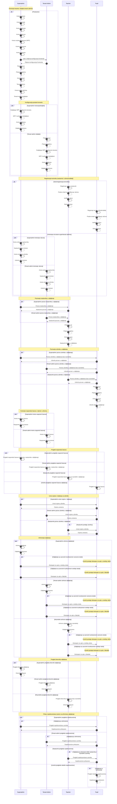

```mermaid
sequenceDiagram
    autonumber
    participant SA as Superadmin
    participant TA as Tenant Admin
    participant T as Teacher
    participant P as Pupil

    Note over SA: Kreiranje tenanta i dodjela tenant admina
    alt Preduslovi
        SA->>SA: Kreira kantone
        SA->>SA: Kreira razrede
        SA->>SA: Kreira predmete
        SA->>SA: Kreira smjerove
        SA->>SA: Kreira nastavne planove (NPP)
        SA->>SA: Kreira kurikulume
        SA->>SA: Kreira semestre

        SA->>TA: Upit o željenoj konfiguraciji frontenda
        TA-->>SA: Željena konfiguracija frontenda
        SA->>SA: Prijavljuje se
        SA-->>SA: Prijava uspješna
        SA->>SA: Kreira tenant
        SA-->>SA: Tenant kreiran
        SA->>SA: Kreira tenant admina
        SA-->>SA: Tenant admin dodijeljen

        Note over SA, TA: Konfiguracija postavki tenanta
        par Superadmin kreiranje/dodjela
            SA->>SA: Dodjeljuje NPP i kurikulume tenantu
            SA-->>SA: NPP i kurikulumi dodijeljeni
            SA->>SA: Kreira odjeljenja
            SA-->>SA: Odjeljenja kreirana
        and Tenant admin dodjela
            TA->>TA: Prijavljuje se
            TA-->>TA: Prijava uspješna
            TA->>TA: Dodjeljuje NPP i kurikulume tenantu
            TA-->>TA: NPP i kurikulumi dodijeljeni
            TA->>TA: Kreira odjeljenja
            TA-->>TA: Odjeljenja kreirana
        end
    end
    
    Note over SA, P: Registracija korisnika (nastavnici i učenici/roditelji)
    alt Samoregistracija korisnika
        T->>T: Registruje se kao nastavnik
        T-->>T: Poslan email za verifikacuju računa
        T->>T: Verifkuje račun
        T-->>T: Račun kreiran
        P->>P: Registruje se kao učenik/roditelj
        P-->>P: Poslan email za verifikacju računa
        P->>P: Verifikuje račun
        P-->>P: Račun kreiran
    else Kreiranje od strane super/tenant admina
        par Superadmin kreiranje računa
            SA->>SA: Kreira račun za nastavnika
            SA-->>SA: Nastavnik račun kreiran
            SA->>SA: Kreira račun za učenika
            SA-->>SA: Učenik račun kreiran
        and Tenant admin kreiranje računa
            TA->>TA: Kreira račun za nastavnika
            TA-->>TA: Nastavnik račun kreiran
            TA->>TA: Kreira račun za učenika
            TA-->>TA: Učenik račun kreiran
        end
    end
    
    Note over SA, T: Pozivanje nastavnika u odjeljenja
    par Superadmin poziva nastavnika u odjeljenje
        SA->>T: Poziva nastavnika u odjeljenje
        T-->>SA: Nastavnik pozvan u odjeljenje
    and Tenant admin poziva nastavnika u odjeljenje
        TA->>T: Poziva nastavnika u odjeljenje
        T-->>TA: Nastavnik pozvan u odjeljenje
    end
    T->>T: Prijavljuje se
    T-->>T: Prijava uspješna
    T->>T: Prihvata poziv
    T-->>T: Nastavnik dodan u odjeljenje
    
    Note over SA, P: Pozivanje učenika u odjeljenja
    par Superadmin poziva učenika u odjeljenje
        SA->>P: Poziva učenika u odjeljenje (kao razrednik)
        P-->>SA: Učenik pozvan u odjeljenje
    and Tenant admin poziva učenika u odjeljenje
        TA->>P: Poziva učenika u odjeljenje (kao razrednik)
        P-->>TA: Učenik pozvan u odjeljenje
    and Nastavnik poziva učenika u odjeljenje
        T->>P: Poziva učenika u odjeljenje (kao razrednik)
        P-->>T: Učenik pozvan u odjeljenje
    end
    P->>P: Prijavljuje se
    P-->>P: Prijava uspješna
    P->>P: Prihvata poziv
    P-->>P: Učenik dodan u odjeljenje

    Note over SA, TA: Kreiranje rasporeda časova: vrijeme i učionica
    par Superadmin kreira raspored časova
        SA->>SA: Kreira raspored časova
        SA-->>SA: Raspored časova kreiran
    and Tenant admin kreira raspored časova
        TA->>TA: Kreira raspored časova
        TA-->>TA: Raspored časova kreiran
    end

    Note over SA, P: Pregled rasporeda časova
    par Superadmin pregleda raspored časova
        SA->>SA: Pregled rasporeda časova (institucija, nastavnika i odjeljenja)
    and Tenant admin pregleda raspored časova
        TA->>TA: Pregled rasporeda časova (institucije, nastavnika i odjeljenja)
    and Nastavnik pregleda raspored časova
        T->>T: Pregled rasporeda časova (ako je razrednik i odjeljenja)
    and Učenik pregleda raspored časova odjeljenja
        P->>P: Pregled rasporeda časova
    end

    Note over SA, P: Unos ocjena i vladanja za učenike
    par Superadmin unosi ocjenu i vladanje
        SA->>P: Unosi ocjenu učeniku
        P-->>SA: Ocjena unesena
    and Tenant admin poziva učenika u odjeljenje
        TA->>P: Unosi ocjenu učeniku
        P-->>TA: Ocjena unesena
    and Nastavnik poziva učenika u odjeljenje
        alt Nastavnik predaje učeniku
            T->>P: Unosi ocjenu učeniku
            P-->>T: Ocjena unesena
        end
    end

    Note over SA, T: Arhiviranje odjeljenja
    par Superadmin arhivira odjeljenje
        SA->>SA: Arhivira odjeljenje
        SA-->>SA: Odjeljenje arhivirano
        alt Odjeljenje sa zavrsnim kurikulumom osnovne skole
            Note over P: Ucenik postaje dostupan za upis u srednju skolu
            SA->>P: Dostupan za upis u srednju skolu
        else Odjeljenje sa zavrsnim kurikulumom srednje skole
            Note over P: Ucenik postaje dostupan za upis u fakultet
            SA->>P: Dostupan za upis u fakultet
        end
    and Tenant admin arhivira odjeljenje
        TA->>TA: Arhivira odjeljenje
        TA-->>TA: Odjeljenje arhivirano
        alt Odjeljenje sa zavrsnim kurikulumom osnovne skole
            Note over P: Ucenik postaje dostupan za upis u srednju skolu
            TA->>P: Dostupan za upis u srednju skolu
        else Odjeljenje sa zavrsnim kurikulumom srednje skole
            Note over P: Ucenik postaje dostupan za upis u fakultet
            TA->>P: Dostupan za upis u fakultet
        end
    and Razrednik arhivira odjeljenje
        T->>T: Arhivira odjeljenje (kao razrednik)
        T-->>T: Odjeljenje arhivirano
        alt Odjeljenje sa zavrsnim kurikulumom osnovne skole
            Note over P: Ucenik postaje dostupan za upis u srednju skolu
            T->>P: Dostupan za upis u srednju skolu
        else Odjeljenje sa zavrsnim kurikulumom srednje skole
            Note over P: Ucenik postaje dostupan za upis u fakultet
            T->>P: Dostupan za upis u fakultet
        end
    end

    Note over SA, P: Pregled dnevnika odjeljenja
    par Superadmin pregleda dnevnik odjeljenja
        SA->>SA: Pregled dnevnika odjeljenja
        SA-->>SA: Dnevnik prikazan
    and Tenant admin pregleda dnevnik odjeljenja
        TA->>TA: Pregled dnevnika odjeljenja
        TA-->>TA: Dnevnik prikazan
    and Razrednik pregleda dnevnik odjeljenja
        T->>T: Pregled dnevnika odjeljenja (kao razrednik)
        T-->>T: Dnevnik prikazan
    end

    Note over SA, P: Prikaz svjedocanstava (samo za arhivirana odjeljenja)
    par Superadmin pregleda svjedocanstva
        alt Odjeljenje je arhivirano
            SA->>P: Pregled svjedocanstava ucenika
            P-->>SA: Svjedocanstvo prikazano
        end
    and Tenant admin pregleda svjedocanstva
        alt Odjeljenje je arhivirano
            TA->>P: Pregled svjedocanstava ucenika
            P-->>TA: Svjedocanstvo prikazano
        end
    and Nastavnik pregleda svjedocanstva
        alt Odjeljenje je arhivirano AND nastavnik je razrednik uceniku
            T->>P: Pregled svjedocanstava ucenika
            P-->>T: Svjedocanstvo prikazano
        end
    and Ucenik pregleda vlastito svjedocanstvo
        alt Odjeljenje je arhivirano
            P->>P: Pregled vlastitog svjedocanstva
            P-->>P: Svjedocanstvo prikazano
        end
    end
```

<!-- TODO: Firebase registracija -->
